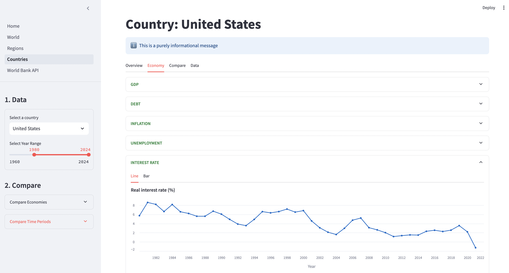
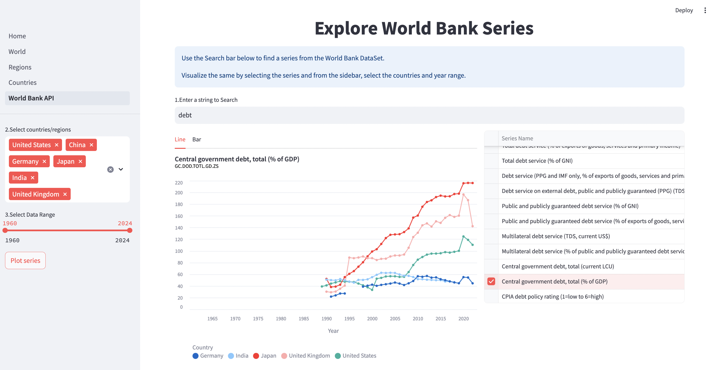

# Analyzing Macro-Economy of the World
 
This app helps visualize World Bank's macroeconomic data to analyze world's economies and also to compare and contrast the different economies. 

Country's Page:

<!--  -->

World Bank API Page:

<!--  -->

### Run:
The app is build using streamlit and python. Deployed on streamlit cloud and can be accessed here: [Economy Visualizer](https://visualize-economies.streamlit.app/)

NOTE: If the app is on sleep mode. Press the button on the screen to bring it back on. It takes about 4-5mins to re-spin.

**To run it locally:**
1. Install the python packages mentioned in the `requirements.txt` file. 
2. Then run the following command from the console: `streamlit run appV2/home.py`

The app should open in your web browser.

Hope it finds good use for you!